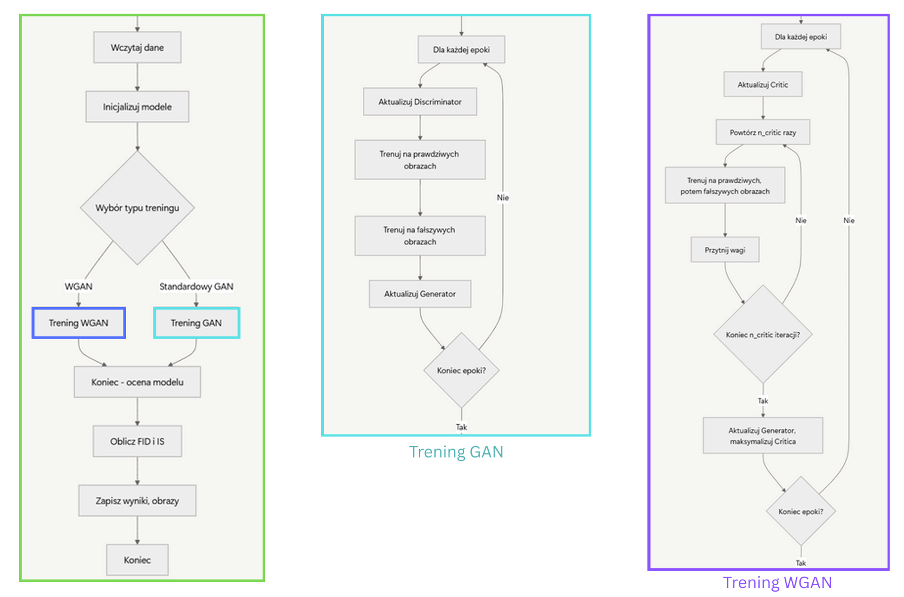
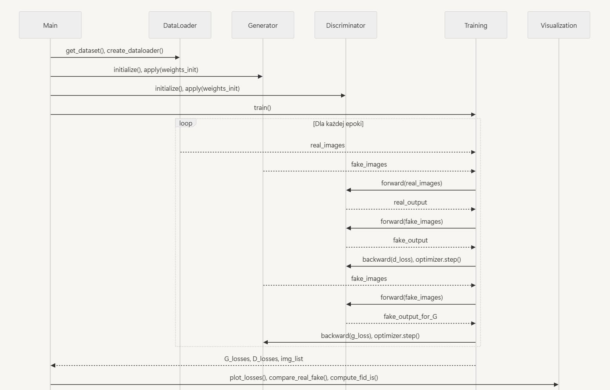
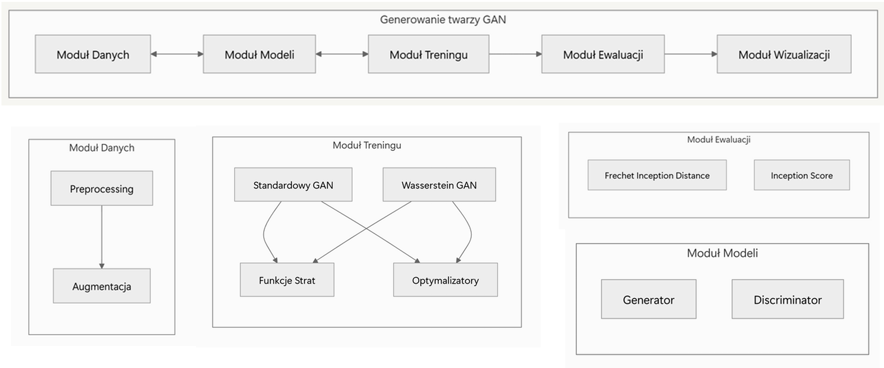
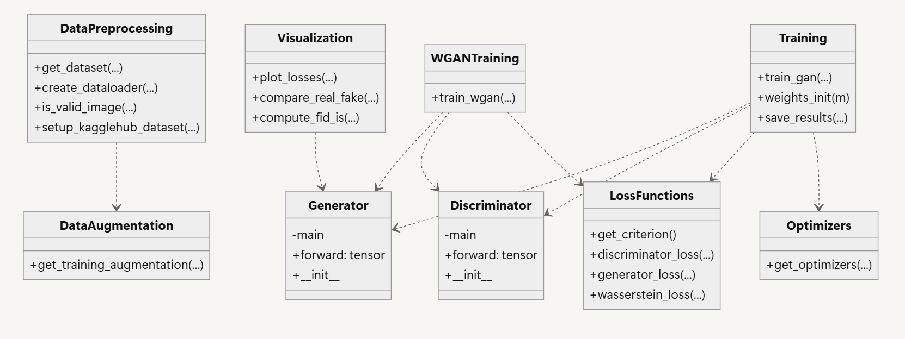

# Generowanie obrazów twarzy za pomocą sieci GAN

## Autorki projektu
- Alicja Wojciechowska
- Weronika Żygis
## Data wykonania projektu
2025r.

## Opis projektu

### Cele projektowe:
Celem projektu jest stworzenie modelu opartego na sieci generatywnej GAN (Generative Adversarial Network), któego zadaniem jest generowanie syntetycznych obrazów twarzy o wysokiej jakości.

Główne cele:
- Implementacja modelu bazując na architekturze DCGAN, która łączy klasyczne założenia GAN-ów z sieciami konwolucyjnymi, co pozwala uzyskać lepsze rezultaty w kontekście generowania obrazów.
- Trening modelu na realistycznych danych. W tym celu wykorzystano zbiór danych CelebFaces Attributes Dataset (CelebA), zawierający tysiące zdjęć twarzy celebrytów o dużej różnorodności cech wizualnych, takich jak wiek, płeć, fryzura czy wyraz twarzy.
- Ewaluacja jakości syntetycznych obrazów przy pomocy metryk FID i IS.
- Zapisywanie wyników i modeli do ponownego użycia. Generowanie przykładowych twarzy oraz tworzenie raportów z treningu.

### Założenia:
- Trening modelu DCGAN lub WGAN na zbiorze danych CelebA.
- Implementacja architektury GAN z możliwością wyboru parametrów treningowych (liczba epok, batch size, learing rate itp.).
- Umożliwienie uruchomienia modelu na kilku procesorach graficznych (GPU).
- Realizacja funkcjonalności:
    - Ładowanie i przetwarzanie danych
    - Trening modelu i zapisywanie checkpointów
    - Wizualizacja strat i generowanych obrazów
    - Generowanie syntetycznych obrazów
    - Ocena jakości obrazu za pomocą odpowiednich metryk

### Przewidywane przeznaczenie:
Tworzenie realistycznych anonimowych wizerunków twarzy bez naruszania prywatności — np. do zastosowań w grach komputerowych, filmach, reklamach, sztuce cyfrowej czy testowaniu systemów rozpoznawania twarzy.

# Analiza systemowa

## Przypadki użycia
## Diagram czynności

## Diagram przypadków użycia – diagram sekwencji

## Podział prac i etapy wykonania projektu
| Etap | Data       | Nazwa elementu projektu                                                              | Odpowiedzialna                       |
|------|------------|--------------------------------------------------------------------------------------|--------------------------------------|
| I    | 05.03.2025 | Research na temat GANów, wybór podejścia (DCGAN)                                     | Alicja Wojciechowska, Weronika Żygis |
| II   | 10.04.2025 | Wybór zbioru danych i preprocessing                                                  | Alicja Wojciechowska                 |
| III  | 20.04.2025 | Szkic architektury sieci                                                             | Weronika Żygis                       |
| IV   | 05.05.2025 | Implementacja generatora i dyskryminatora.                                           | Alicja Wojciechowska                 |
|      |            | Konfiguracja treningu modelu                                                         | Weronika Żygis                       |
| V    | 08.05.2025 | Wybór funkcji strat dla generatora i dyskryminatora (loss functions)                 | Weronika Żygis                       |
|      |            | Wybór optymalizatora (ADAM)                                                          | Alicja Wojciechowska                 |
| VI   | 10.05.2025 | Uczenie modelu. Śledzenie metryk (porównywanie loss dla generatora i dyskryminatora) | Weronika Żygis                       |
| VII  | 13.05.2025 | Wizualizacja wyników. Wprowadzenie augmentacji i dodanie nowego podejścia – WGAN     | Weronika Żygis                       |
| VIII | 16.05.2025 | Ewaluacja i analiza wyników (FID, IS)                                                | Alicja Wojciechowska                 |
| IX   | 19.05.2025 | Dokumentacja projektu                                                                | Alicja Wojciechowska, Weronika Żygis |

# Projekt architektury

- Zastosowanie konwolucyjnych i transponowanych warstw konwolucyjnych w dyskryminatorze i generatorze.
- Użycie funkcji aktywacji ReLU (w generatorze) oraz LeakyReLU (w dyskryminatorze) dla lepszej propagacji gradientów.
- Normalizacja wsadowa (batch normalization) w celu stabilizacji procesu uczenia.

## Wybór technologii informatycznych
- PyTorch 
- NumPy
- Kaggle Api
- Google Colab - przyspieszenie trenowania dzięki wsparciu GPU.

## Projekt architektury aplikacji
Projekt składa się z dwóch odrębnych modeli: generatora i dyskryminatora. Zadaniem generatora jest tworzenie fałszywych obrazów, które wyglądają jak obrazy z danych treningowych. Z kolei zadaniem dyskryminatora jest ocena obrazu i określenie, czy pochodzi on z prawdziwego zbioru treningowego, czy został wygenerowany przez generator.

Podczas treningu generator nieustannie stara się przechytrzyć dyskryminatora, generując coraz bardziej realistyczne obrazy. Jednocześnie dyskryminator doskonali się w rozróżnianiu prawdziwych i fałszywych obrazów. Proces ten ma charakter rywalizacji. Równowaga tej „gry” zostaje osiągnięta wtedy, gdy generator tworzy tak realistyczne obrazy, że dyskryminator nie potrafi już ich odróżnić od prawdziwych — i zmuszony jest zgadywać z 50% pewnością, czy dany obraz jest prawdziwy, czy fałszywy.

W projekcie wykorzystujemy DCGAN:

**Dyskryminator** składa się z warstw konwolucyjnych z krokiem (ang. strided convolutions), warstw normalizacji wsadowej (batch normalization) oraz aktywacji LeakyReLU. Jako wejście przyjmuje obraz o rozmiarze 3x64x64 (RGB), a jego wyjściem jest skalarna wartość reprezentująca prawdopodobieństwo, że dany obraz pochodzi z rzeczywistego zbioru danych.

**Generator** z kolei zbudowany jest z warstw transponowanych konwolucyjnych (conv-transpose), warstw normalizacji wsadowej oraz aktywacji ReLU. Jako dane wejściowe przyjmuje wektor latentny z, wylosowany z rozkładu normalnego, a na wyjściu generuje obraz RGB o rozmiarze 3x64x64. Warstwy transponowane umożliwiają przekształcenie wektora latentnego w trójwymiarową strukturę odpowiadającą obrazowi.

## Projekt bazy danych (użyte tabele w przypadku relacyjnych baz danych)
Nie dotyczy – projekt nie korzysta z klasycznej relacyjnej bazy danych. Dane wejściowe (obrazy) są przechowywane jako pliki w systemie plików.

## Diagram komponentów

## Diagram klas

# Implementacja i testowanie aplikacji z użyciem wybranego narzędzia do projektowania zespołowego
W ramach zespołowego podejścia do projektowania i wdrażania modelu generatywnego (DCGAN), wykorzystano narzędzia wspierające współpracę programistyczną, takie jak Git i GitHub, co umożliwiło śledzenie zmian, przypisywanie zadań i wspólne rozwijanie kodu. 

Po ukończeniu implementacji przystąpiono do testowania i oceny jakości generowanych obrazów. W tym celu zastosowano dwie powszechnie uznawane metryki:

1. FID (Fréchet Inception Distance)
FID mierzy odległość statystyczną między cechami obrazów rzeczywistych a obrazów generowanych, wyekstrahowanymi przez sieć Inception v3. Z przedostatniej warstwy tej sieci pobierane są wektory cech reprezentujące wysokopoziomowe właściwości obrazów (np. układ oczu, kształt twarzy, obecność okularów)
Im niższy wynik FID, tym lepsza jakość oraz większe podobieństwo generowanych obrazów do prawdziwych danych.

    Zalety: 
    - Uwzględnia zarówno jakość obrazu, jak i różnorodność.
    - Dobrze koreluje z oceną wizualną człowieka

    Interpretacja: 
    - FID bliski 0 oznacza, że obrazy syntetyczne są niemal nie do odróżnienia od rzeczywistych.
    - FID powyżej 50-100 sugeruje, że model generuje obrazy słabej jakości lub z dużymi różnicami względem danych rzeczywistych.

2. IS (Inception Score)
IS bazując na sieci Inception v3 sprawdza czy model spełnia dwie główne zasady:
- Generowany obraz jest wyraźny i realistyczny. To znaczy, że klasyfikator (Inception v3) z wysokim prawdopodobieństwem przypisuje obraz do danej klasy (jest pewny tego co widzi).
- Zbiór obrazów jest zróżnicowany. Model powinien generować twarze o różnych cechach (a nie np. tylko twarze z okularami i wąskimi twarzami)

    Zalety: 
    - Szybkość. IS wymaga tylko przejścia wygenerowanych obrazów przez sieć.
    - 

    Interpretacja: 
    - Im wyższy wynik IS, tym lepsza jakość i różnorodność obrazów. Niska wartość może świadczyć o powtarzalnych lub niskiej jakości generacjach.

Obie metryki zostały zastosowane po zakończeniu procesu uczenia modelu, umożliwiając obiektywną ocenę postępów, porównanie wariantów architektury oraz analizę wpływu modyfikacji takich jak zastosowanie Wasserstein GAN czy technik augmentacji danych.

  
